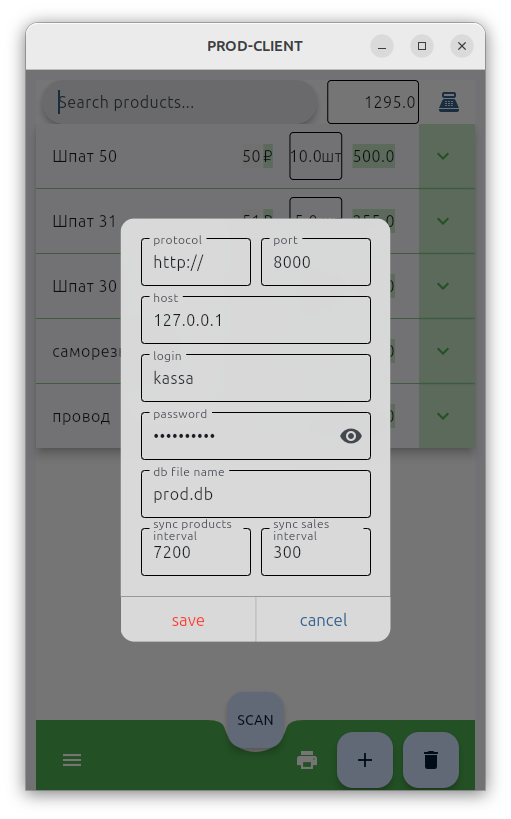
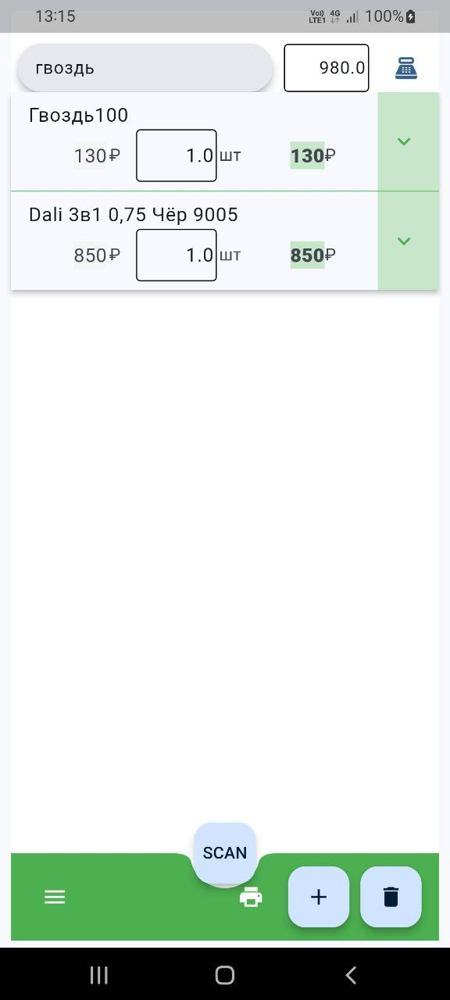

# prod-flet
frontend for ["prod"](https://github.com/usermicrodevices/prod/) (warehouse system management based on [Django](https://github.com/django/django)). client developed in [Flet (it is Python wraper arount Flutter)](https://github.com/flet-dev/flet)

[](https://github.com/usermicrodevices/prod/blob/main/LICENSE)




# installation
```
git clone git@github.com:usermicrodevices/prod-flet.git
cd prod-flet
python -m venv venv
. ./venv/bin/activate
pip install .
```

# fix ubuntu run missing dependencies
```
sudo apt update
sudo apt install libmpv-dev libmpv2
sudo ln -s /usr/lib/x86_64-linux-gnu/libmpv.so /usr/lib/libmpv.so.1
```

# running
```
flet run src/main.py
```

# build android
```
flet build apk
```

# build linux
```
flet build linux
```

# build windows
```
flet build windows
```

# pack as standalone executable file
```
pip install pyinstaller
flet pack --icon kassa.png --name prod-flet src/main.py
```

# generate desktop and autostart files in linux Ubuntu for Gnome Desktop
```
sudo apt install gnome-startup-applications
./gen_desk.sh
```


# add linux user group "dialout" for read and write serial port
first check serial group
```
ls -la /dev/ttyS0
```
or
```
ls -la /dev/ttyUSB0
```
view like ```crw-rw---- 1 root dialout 188, 0 мар 30 06:18 /dev/ttyUSB0```
and next add group
```
sudo usermod -a -G dialout $USER
```


# if set "dialout" group not help, set linux permissions for read and write serial port for any user
```
sudo chmod a+rw /dev/ttyS0
```
or
```
sudo chmod a+rw /dev/ttyUSB0
```


# Brief description

This application supports all major operating systems: Linux, Windows, MacOS, iOS, Android. The graphical user interface is built on the principle of filling the customer's basket, but in reality it is a cash register software that performs all mathematical calculations of the POS terminal. Product search is possible in the mode of typing from the keyboard or scanning with a connected scanner. The mobile version also contains a built-in barcode and QR code scanner - so it is possible to use a phone or tablet as a data collection terminal. After synchronizing the directories with the server, the application can work autonomously. Synchronization of directories is configured in selected time intervals. Sending sales and order data to the server can also be delayed in case of network breaks and is configured in selected time intervals. Trading equipment can be integrated through device drivers. An example of connecting trade scales can be found in the open source project. Banking and fiscal equipment can also be integrated through the appropriate drivers from manufacturers. Entering balances to control stocks (inventory management) in a warehouse or retail outlet from the application is done through an order and in the server admin panel it is changed to the appropriate document type with the appropriate counterparty.

# Краткое описание

Это приложение поддерживает все основные операционные системы: Linux, Windows, MacOS, iOS, Android. Графический интерфейс пользователя построен по принципу заполнения корзинки покупателя, но в реальности это является кассовым программным обеспечением выполняющим все математические расчёты POS терминала. Поиск товара возможен в режиме набора текста с клавиатуры или сканирования подключенным сканером. Мобильная версия также содержит встроенный сканер штрихкодов и QR-кодов - поэтому есть возможность использовать телефон или планшет как терминал сбора данных. После синхронизации справочников с сервером, приложение может работать автономно. Синхронизация справочников настраивается в выбранных временных интервалах. Отправка на сервер данных о продажах и заказах также может быть отложена при обрывах сети и настраивается в выбранных временных интервалах. Торговое оборудование может быть интегрировано через драйверы устройств. Пример подключения торговых весов можно найти в открытом коде проекта. Банковское и фискальное  оборудование также может быть интегрировано через соответствующие драйверы от производителей. Ввод остатков для контроля запасов на складе или торговой точки из приложения проводится через заказ и в админ-панели сервера меняется на соответствующий тип документа с подходящим контрагентом.
